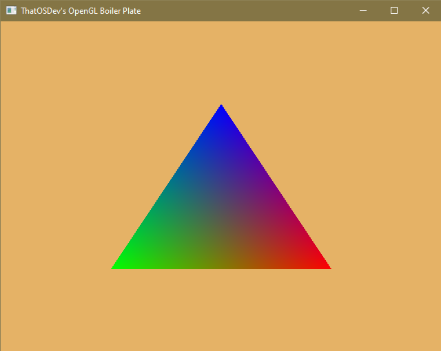

# ThatOSDev's OpenGL Boiler Plate

This boiler plate code is for all of my OpenGL projects. I see no need to constantly recreate this same code that I use in all of my projects. So I put it here for ease of use. All needed files are included.  
  
  NOTE : Read the top of the main.c file. Also add the correct include paths. There are no linker paths to worry about.  
  
  This project is setup for windows, but can be used in other operating systems. This picture shows what GLFW3 files to add to your project if you are on windows. This project works with GLFW 3.3.8.  
    
  
  This picture shows what it should look like once up and running.  
  
